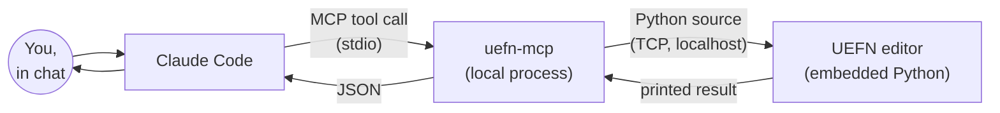

# uefn-mcp docs — start here

How `uefn-mcp` actually works, under the hood, and where to look for a specific question. These docs are for anyone who wants to understand (or extend) the server, not just use it — if you only want to *use* it, the top-level [README.md](../README.md) is enough. Claude Code: read this file before consulting anything else under `docs/`.

## I want to... (routing table)

| Want to... | Read |
| --- | --- |
| Add or change what item a device spawns/grants | [how-to-set-item-spawner-content.md](how-to-set-item-spawner-content.md) |
| Figure out if some device setting is scriptable at all | [gotchas/user-options.md](gotchas/user-options.md) (bools/numbers/enums), then [gotchas/item-content/index.md](gotchas/item-content/index.md) (item/weapon content specifically) |
| Wire one device to trigger another | [gotchas/event-wiring.md](gotchas/event-wiring.md) |
| Move, rescale or reposition placed actors — **read before any bulk transform work** | [gotchas/transform-persistence.md](gotchas/transform-persistence.md) |
| Spawn/configure a project's own compiled Verse `creative_device`, or bind a native device into its `@editable` fields | [how-to-spawn-and-wire-custom-verse-devices.md](how-to-spawn-and-wire-custom-verse-devices.md) |
| See the map for yourself instead of asking the user for a screenshot | [how-to-screenshot-the-level.md](how-to-screenshot-the-level.md) |
| Set up a new UEFN project for `uefn-mcp` | [setup.md](setup.md) |
| Understand the MCP↔bridge↔UEFN protocol end to end | [architecture.md](architecture.md) → [mcp-basics.md](mcp-basics.md) → [protocol.md](protocol.md) → [request-lifecycle.md](request-lifecycle.md) |
| Add a new `@mcp.tool()` | [architecture.md](architecture.md)'s `server.py` section, plus the root [`CLAUDE.md`](../CLAUDE.md) |
| Debug a silent/failed connection to UEFN | [gotchas/misc.md](gotchas/misc.md) (stale `uefn-mcp.exe` processes), then [setup.md](setup.md) |
| Re-investigate item/weapon content automation | [gotchas/item-content/index.md](gotchas/item-content/index.md) — read this before re-testing anything, it's a multi-pass investigation with real dead ends already ruled out |

## Every doc, one line each

- **[mcp-basics.md](mcp-basics.md)** — the MCP connection itself: how `uefn-mcp` gets launched, how Claude Code and it exchange messages over stdio.
- **[architecture.md](architecture.md)** — the three layers of the codebase and how they stack.
- **[protocol.md](protocol.md)** — the wire protocol `uefn-mcp` speaks to UEFN (Epic's, not invented here): UDP discovery, then a TCP command channel.
- **[request-lifecycle.md](request-lifecycle.md)** — one tool call (`spawn_actor`) traced end to end.
- **[setup.md](setup.md)** — what `setup_uefn_project` and `claude mcp add` change on disk, and why both need a restart.
- **[how-to-screenshot-the-level.md](how-to-screenshot-the-level.md)** — render the level to a PNG from Python via `SceneCapture2D`, so Claude can look at the map itself. Supersedes the `HighResShot` dead end.
- **[how-to-set-item-spawner-content.md](how-to-set-item-spawner-content.md)** — the current, working method for scripting Item Spawner V3 content.
- **[how-to-spawn-and-wire-custom-verse-devices.md](how-to-spawn-and-wire-custom-verse-devices.md)** — spawning a project's own compiled Verse `creative_device`, reading/writing its `@editable` fields, the native-device-binding wall, and the Verse-tag workaround.
- **[gotchas/user-options.md](gotchas/user-options.md)** — Fortnite Creative "User Options" are settable via `set_editor_property`, not `set_user_option_value`.
- **[gotchas/event-wiring.md](gotchas/event-wiring.md)** — device-to-device event hookups are Details-panel-only from Python; Verse can do it but can't be built headlessly.
- **[gotchas/item-content/index.md](gotchas/item-content/index.md)** — the full multi-pass investigation into whether item/weapon content is ever scriptable.
- **[gotchas/transform-persistence.md](gotchas/transform-persistence.md)** — moving a placed actor silently fails to save without `actor.modify()`, and leaves its collision body behind; plus how to verify a move for real.
- **[gotchas/misc.md](gotchas/misc.md)** — smaller one-off findings (basic-shape mesh spawning, stale `uefn-mcp.exe` processes, `is_object_valid`'s tuple return).

## The one-paragraph version

Claude Code doesn't touch UEFN directly. It talks to a local Python process (`uefn-mcp`, started over MCP/stdio) that knows how to speak Epic's **Python Editor Script Plugin remote execution protocol**. That protocol lets any client on your machine discover a running Unreal/UEFN editor over UDP, open a TCP connection to it, and send it Python source to execute inside the editor's own embedded interpreter — the same interpreter behind `Window > Developer Tools > Python`. `uefn-mcp` builds that Python source (calls into `unreal.EditorActorSubsystem`, `unreal.EditorAssetLibrary`, etc.) on the fly for each tool call, sends it over, and turns the printed result back into structured JSON for Claude to reason about.

