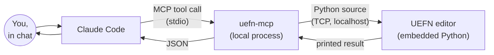

# uefn-mcp docs

How `uefn-mcp` actually works, under the hood.

These docs are for anyone who wants to understand (or extend) the server, not
just use it. If you only want to *use* it, the top-level [README.md](../README.md)
is enough.

## Map

- **[mcp-basics.md](mcp-basics.md)** — start here if you're asking "do I
  need to start this myself?" or "how does Claude even talk to it?". Covers
  the MCP connection itself: how `uefn-mcp` gets launched, and how Claude
  Code and `uefn-mcp` exchange messages over stdio.
- **[architecture.md](architecture.md)** — the three layers of the codebase
  and how they stack on top of each other.
- **[protocol.md](protocol.md)** — the wire protocol `uefn-mcp` speaks to
  UEFN: UDP discovery, then a TCP command channel. This is Epic's protocol,
  not something invented by this project.
- **[request-lifecycle.md](request-lifecycle.md)** — a single tool call
  (`spawn_actor`) traced end to end, from the words you type to the actor
  appearing in the level.
- **[setup.md](setup.md)** — what `setup_uefn_project` and
  `claude mcp add` actually change on disk, and why both are one-time,
  restart-required steps.

## The one-paragraph version

Claude Code doesn't touch UEFN directly. It talks to a local Python process
(`uefn-mcp`, started over MCP/stdio) that knows how to speak Epic's
**Python Editor Script Plugin remote execution protocol**. That protocol lets
any client on your machine discover a running Unreal/UEFN editor over UDP,
open a TCP connection to it, and send it Python source to execute inside the
editor's own embedded interpreter — the same interpreter behind
`Window > Developer Tools > Python`. `uefn-mcp` builds that Python source
(calls into `unreal.EditorActorSubsystem`, `unreal.EditorAssetLibrary`, etc.)
on the fly for each tool call, sends it over, and turns the printed result
back into structured JSON for Claude to reason about.

