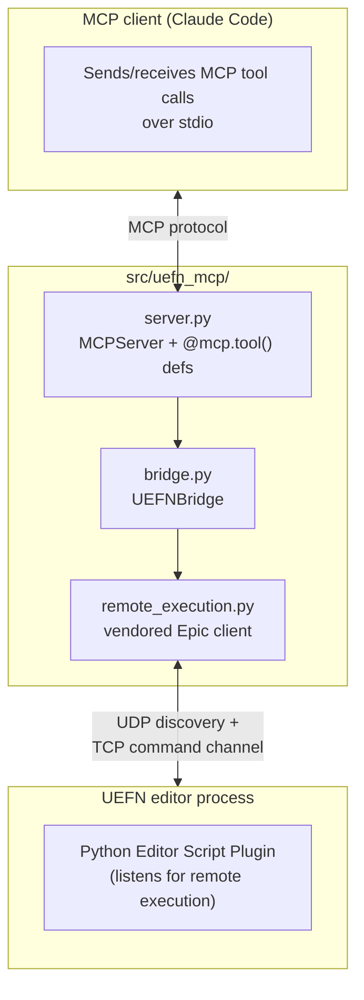

# Architecture

`uefn-mcp` is split into three layers, each in `src/uefn_mcp/`, and each with
a single job. Higher layers depend on lower ones; lower layers know nothing
about the layers above them.

## `remote_execution.py` — the wire protocol client

A vendored, unmodified copy of Epic's `PythonScriptRemoteExecution` client
(see its `Copyright Epic Games` header). This is treated as third-party code
in this repo — no project-specific logic gets added here, so it stays a
drop-in match for whatever ships with the engine.

It implements two things:

1. **Discovery** — broadcast a UDP "ping", collect "pong" replies from any
   Unreal/UEFN editor instances listening on the multicast group. Each reply
   is a "node."
2. **Command connection** — once a node is picked, open a TCP connection to
   it and exchange JSON-encoded messages: send Python source as a
   `command` message, receive a `command_result` message back.

See [protocol.md](protocol.md) for the message-level detail.

## `bridge.py` — `UEFNBridge`

A thread-safe wrapper around exactly **one** `RemoteExecution` command
connection, exposed as a module-level singleton via `get_bridge()`. This is
the layer that turns "raw editor scripting" into something a tool function
can call without thinking about sockets.

Two entry points, in increasing order of what they do for you:

- **`exec_raw(code, exec_mode)`** — runs `code` in the editor, returns the
  protocol's raw `command_result` dict (`success`, `result`, `output`). Used
  directly only by the `execute_python` escape-hatch tool.
- **`exec_json(code, **params)`** — the workhorse. Wraps `code` so that:
  - `params` are JSON-serialized and reconstructed inside the editor as a
    `_params` dict, so tool arguments reach the running Python without any
    manual string-building.
  - `code` is required to assign its answer to a variable named `result`.
  - The wrapped script prints that `result` between two sentinel markers
    (`@@UEFN_MCP_RESULT_START@@` / `@@UEFN_MCP_RESULT_END@@`) so it can be
    pulled back out of the editor's stdout reliably — the editor's own log
    output can't otherwise be told apart from the answer.
  - Raises `UEFNScriptError` if the script failed or the markers never show
    up (e.g. the script crashed before reaching the `print`).

`UEFNBridge` also handles connection lifecycle: it connects lazily on first
use, and if a command fails because the connection went stale (e.g. UEFN was
restarted), it reconnects once and retries automatically.

## `server.py` — MCP tool surface

Defines `mcp = MCPServer("uefn-mcp")` and every `@mcp.tool()` function
Claude can call. Almost every tool follows the same shape: build a Python
source string that calls into `unreal.*` APIs and ends by assigning to
`result`, then hand it to `get_bridge().exec_json(...)` along with the tool's
arguments as keyword params.

Shared snippets are factored out as small string builders and concatenated
per tool, rather than templated with a framework:

- `_ACTOR_LOOKUP` — finds an actor in the level by its editor label.
- `_transform_dict(actor_expr, indent)` — serializes an actor's
  location/rotation/scale into the dict shape every transform-returning tool
  uses.

Two tools are the exception, in that they don't touch a running editor at
all — `find_uefn_projects` and `setup_uefn_project` only read/write files on
your local disk (see [setup.md](setup.md)).
