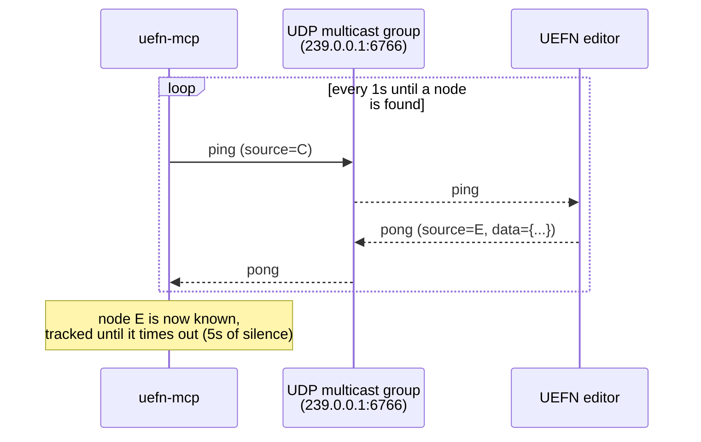
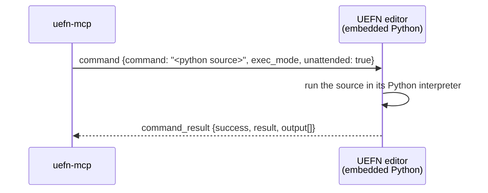

# The remote execution protocol

This is Epic's protocol, implemented (not designed) by [`remote_execution.py`](../../src/uefn_mcp/remote_execution.py). It's the same protocol behind Unreal's "Remote Execution" Python console feature — UEFN just ships it turned off by default (see [setup.md](setup.md)).

Two channels are involved, for two different jobs:

| Channel | Transport | Job |
|---|---|---|
| Broadcast | UDP multicast | Discover which editor instances are running, and ask one of them to open a command connection |
| Command | TCP, localhost | Send Python source to run, receive the result |

Every message on both channels is UTF-8 JSON with a common envelope:

```json
{
  "version": 1,
  "magic": "ue_py",
  "type": "command",
  "source": "<sender node id>",
  "dest": "<recipient node id, omitted for broadcast>",
  "data": { "...": "message-specific payload" }
}
```

## 1. Discovery (UDP)

`uefn-mcp` and the UEFN editor both join the same UDP multicast group (`239.0.0.1:6766` by default — must match the project's `RemoteExecutionMulticastGroupEndpoint` setting). `uefn-mcp` broadcasts a `ping` once a second; every listening editor instance replies with a `pong` carrying its node ID. `uefn-mcp` (via `UEFNBridge.connect()`) waits up to 5 seconds and then picks the first node it heard from — if two UEFN instances are open, whichever answers first wins.



## 2. Opening a command connection (UDP → TCP)

Once a node is chosen, `uefn-mcp` starts listening on a local TCP port and broadcasts an `open_connection` message addressed to that node's ID, telling it where to connect. The editor then initiates the actual TCP connection back to `uefn-mcp`.

That port is **a free one this process reserves for itself**, not Epic's default. Epic's client hands every process the same 6776 with `SO_REUSEADDR`, so two clients both announce 6776 and the editor's callback lands on whichever bound it last — [`bridge.py`](../../src/uefn_mcp/bridge.py)'s `_free_port()` exists to prevent exactly that. With it, **one editor serves two concurrent command connections without trouble** (measured: two processes, interleaved calls, all succeeded), which is what makes two Claude Code sessions against one editor work.

```mermaid
sequenceDiagram
    participant C as uefn-mcp<br/>(TCP listener, own free port)
    participant N as UDP multicast group
    participant E as UEFN editor

    C->>N: open_connection (dest=E, data={command_ip, command_port})
    N-->>E: open_connection
    E->>C: TCP connect to 127.0.0.1:&lt;command_port&gt;
    Note over C,E: TCP command channel is now open
```

`uefn-mcp` retries this handshake up to 6 times (5s apart, 30s total) before giving up — this is where the "No running Unreal/UEFN editor was discovered" error comes from if the editor isn't listening.

## 3. Running a command (TCP)

Every tool call boils down to one round-trip on the open TCP channel: send a `command` message containing the Python source and an execution mode, get back one `command_result` message.



`exec_mode` is one of:

- **`ExecuteFile`** (default, used for everything except `execute_python`'s `statement`/`eval` modes) — runs the source as a full script, so it can contain multiple statements, imports, function defs, etc.
- **`ExecuteStatement`** — runs and prints a single statement.
- **`ExecuteStatement`/`EvaluateStatement`** — evaluates a single expression and returns its value directly, without needing a `print`.

`command_result.output` is a list of `{output: "..."}` chunks — this is whatever the script printed or logged, concatenated in `bridge.py` via `extract_output_text`. `command_result.success` reflects whether the script raised an unhandled exception, not whether your code's own logic "worked" — a script that runs to completion but produces a `result = {'success': False, ...}` dict (as most tools in `server.py` do on a lookup miss) still reports `success: True` at the protocol level.
