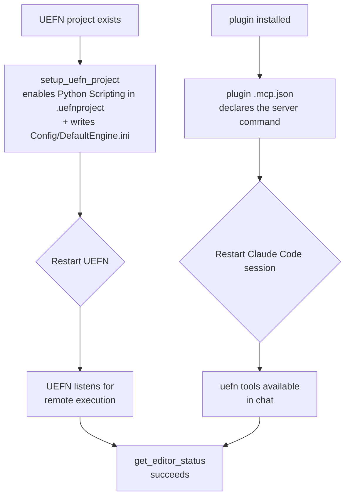
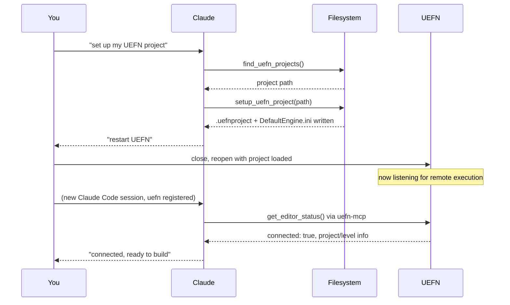

# Setup, and what it actually changes

Two independent things have to be true before any tool call in `server.py` can reach a running editor. Neither is automatic, and both require a restart of *something* to take effect — which is why setup feels like more steps than it should.



## Side 1 — UEFN's Python switches

Two *independent* project-level switches both have to be on before an editor will answer a discovery ping, and UEFN ships with **both off**. Missing either one looks identical from `uefn-mcp`'s side — a silent `get_editor_status` failure — so it's worth checking both rather than assuming the ini alone is enough.

**1a. Python Scripting itself** (Project Settings > Python in the UEFN UI). This is the plugin being active at all — remote execution has no effect if it's off. It lives in the `.uefnproject` file itself, as JSON:

```json
"dataSets": {
    "experimental": {
        "pythonExperimental": {
            "bEnablePythonForProject": true
        }
    }
}
```

**1b. Remote execution** for that plugin, once it's active. This one is an editor-startup setting, not something a running process can be told to flip on live, so it lives in the project's own config file:

`<project folder>/Config/DefaultEngine.ini`

```ini
[/Script/PythonScriptPlugin.PythonScriptPluginSettings]
bRemoteExecution=True
RemoteExecutionMulticastGroupEndpoint=239.0.0.1:6766
RemoteExecutionMulticastBindAddress=127.0.0.1
RemoteExecutionMulticastTtl=0
```

`setup_uefn_project` (in `server.py`) sets both: it edits the `.uefnproject` JSON to turn on `bEnablePythonForProject` (never overwritten once true — there's no equivalent of the ini's `force` for it, since it's strictly on-or-off), and it finds-or-creates the ini's `[/Script/PythonScriptPlugin.PythonScriptPluginSettings]` section and sets its four keys, leaving anything else in either file untouched. `find_uefn_projects` exists purely to locate the project folder on disk first, by walking for a `*.uefnproject` file, since UEFN doesn't expose that path anywhere `uefn-mcp` could otherwise query.

Because both files are only read at editor startup: **if UEFN was already open when either changed, it has to be closed and reopened.** No amount of retrying the connection from `uefn-mcp`'s side will help until that happens — `bridge.py`'s discovery step simply won't hear a `pong` from an editor that never turned both switches on. This also means a project that had Python Scripting enabled *by hand* in the UEFN UI before `uefn-mcp` ever touched it needs the same restart if that toggle happened while the editor was already running.

## Side 2 — registering `uefn-mcp` with Claude Code

The plugin's `.mcp.json` tells Claude Code *how to start* the `uefn-mcp` process: `uv --directory ${CLAUDE_PLUGIN_ROOT} run uefn-mcp`. `${CLAUDE_PLUGIN_ROOT}` resolves to the plugin's own directory under `~/.claude/plugins/cache/`, so the server always runs against the installed copy no matter which folder the session is working in.

What *does* matter is **scope** — where that registration itself gets stored, which controls when Claude Code even considers starting the server:

| Scope | Stored in | Available when... |
|---|---|---|
| `local` (default) | `~/.claude.json`, under the *current project's* entry | you start Claude Code from that one specific folder |
| `user` (`-s user`) | `~/.claude.json`, top-level, not tied to a project | you start Claude Code from anywhere |
| `project` (`-s project`) | `.mcp.json` checked into the repo | anyone with the repo, from that folder |

Install the plugin at **user** scope, not project scope. A session working in a map's own notes repository still has to reach the `uefn` tools, and a project-scoped install would only be visible inside this repository — which is not where map building happens.

MCP servers are only started when a Claude Code **session starts** — adding or changing a registration never affects a session already in progress. That's the second restart: not UEFN this time, but Claude Code itself.

## Putting both sides together


