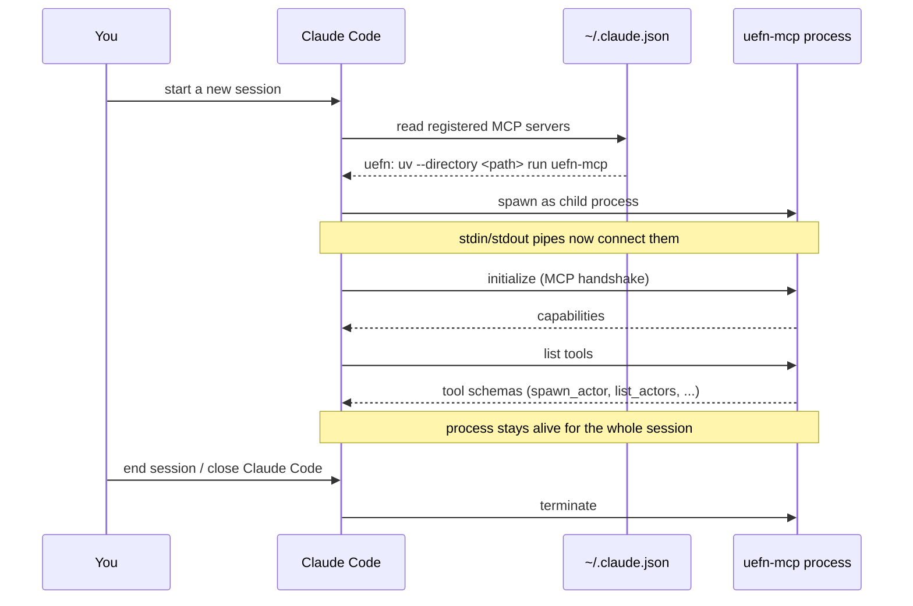

# How Claude talks to `uefn-mcp`

The other docs cover what happens *after* Claude decides to call a tool
([request-lifecycle.md](request-lifecycle.md)) and what `uefn-mcp` then says
to UEFN ([protocol.md](protocol.md)). This one covers the layer in between:
the MCP connection itself — the thing that has to exist before any of that
can happen. Written as the questions people actually ask.

## Do I have to start `uefn-mcp` myself?

No. There's no server to launch, no terminal to leave open, no background
service to manage. `uefn-mcp` is not a long-running thing you start once and
come back to — it's a short-lived subprocess that **Claude Code starts and
stops on its own**, once per session, only if the server is registered.

## So how does it get started?

`claude mcp add uefn -- uv --directory "<repo path>" run uefn-mcp` (the setup
step from the README) doesn't start anything by itself — it just writes a
launch command into Claude Code's config
(`~/.claude.json`, see [setup.md](setup.md) for the scope details).

The actual start happens **when a new Claude Code session begins**: Claude
Code reads that config, and for every registered MCP server it's allowed to
use, it spawns the server's command as a child process —
`uv --directory <repo path> run uefn-mcp` in this case — and keeps a pipe
open to it for the lifetime of the session. Close the session (or restart
Claude Code), and that child process is torn down with it. This is also
exactly why registering or re-registering a server never affects a session
already in progress — the spawning only happens at session start.

This is a completely separate process from UEFN. At this point nothing has
tried to reach the editor yet — `uefn-mcp` doesn't connect to UEFN until the
*first* tool call that actually needs it runs (see the "lazy connect" note
below).

## How does Claude actually talk to it, mechanically?

Over **stdio** — the child process's standard input and standard output are
the entire connection. There's no port, no localhost URL, nothing you'd see
in a network tool. Claude Code writes MCP protocol messages (JSON-RPC 2.0)
to the process's stdin; `uefn-mcp` writes its responses to stdout. The
`MCPServer` object in [server.py](../src/uefn_mcp/server.py) (from the
`mcp` Python package) is what handles that JSON-RPC layer — reading
requests, matching them to the right `@mcp.tool()`-decorated function by
name, and writing back the return value as the response. None of the tool
functions in `server.py` see this directly; they just get called with plain
Python arguments and return plain Python values.

Two kinds of messages matter here:

- **`list tools`** — sent once, early in the session. Returns every
  `@mcp.tool()` function's name, parameter schema, and docstring. This is
  how Claude knows `spawn_actor` exists and what arguments it takes, without
  ever reading `server.py`.
- **`call tool`** — sent each time Claude decides to use one, with the
  arguments as JSON. `uefn-mcp` runs the matching function and sends back
  whatever it returns.

## Is this the same connection as the one to UEFN?

No — and this is the part worth keeping straight, because there are really
**two separate hops**, on two separate protocols, with two separate
lifecycles:

| | Claude Code ↔ uefn-mcp | uefn-mcp ↔ UEFN |
|---|---|---|
| Protocol | MCP (JSON-RPC over stdio) | Epic's remote execution protocol (UDP + TCP) |
| Starts | when the Claude Code session starts | lazily, on the first tool call that touches the editor |
| Requires | server registered (`claude mcp add`) | UEFN open, project loaded, remote execution enabled (see [setup.md](setup.md)) |
| If it's down | tool calls aren't available to Claude at all | tool calls fail with a connection error, but the MCP session itself is fine |

So it's possible (and normal) for `uefn-mcp` to be running and connected to
Claude Code while UEFN is closed — you'll just get a connection error the
moment a tool tries to reach the editor, e.g. from `get_editor_status`,
rather than at session start.

## Why does a restart show up twice in setup, then?

Because the two hops each have their own "only reads config at start" rule:

- `uefn-mcp`'s registration only takes effect for a **new Claude Code
  session** (this doc).
- UEFN's remote execution setting only takes effect after **UEFN itself
  restarts** ([setup.md](setup.md)).

They're unrelated restarts of two different programs — it just looks like
one step because both usually happen back to back during first-time setup.
