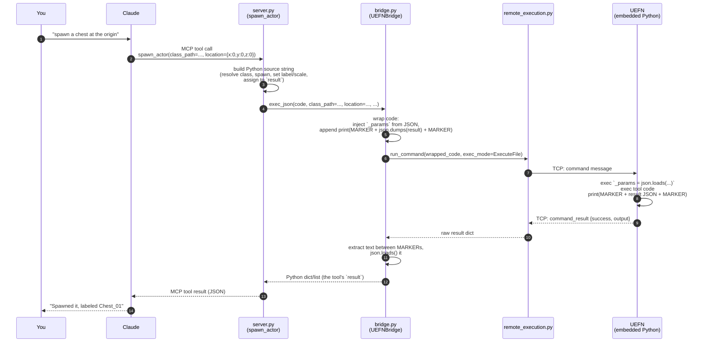

# A tool call, end to end

Tracing one concrete call — `spawn_actor` — from a chat message down to an
actor appearing in the level and back. The same shape applies to every other
tool in `server.py`.



## What each layer actually contributes

**`server.py`** only knows Unreal/Fortnite concepts. Its job for
`spawn_actor` is to produce a string of Python that, if you pasted it
straight into UEFN's own Python console, would do the right thing:

```python
import unreal
_eas = unreal.get_editor_subsystem(unreal.EditorActorSubsystem)
# ...resolve _params['class_path'] to a class...
_actor = _eas.spawn_actor_from_class(_cls, _location, _rotation)
# ...set label/scale from _params...
result = {"success": True, "label": _actor.get_actor_label(), ...}
```

It never sees a socket. `_params` is a name it can rely on existing because
`exec_json` guarantees it.

**`bridge.py`** doesn't know anything about actors or classes. It knows two
things: how to get `class_path`/`location`/etc. into the editor process as
`_params` (JSON round-trip), and how to get a `result` value back out
reliably (the marker sentinels, because the editor's own log noise is mixed
into the same stdout stream and can't otherwise be told apart from the
answer).

**`remote_execution.py`** doesn't know Python source is even involved — as
far as it's concerned it's shipping an opaque `command` string and waiting
for one `command_result` reply. See [protocol.md](protocol.md) for that
layer.

## Why errors look different depending on where they happen

- **No editor found / connection drops** → `UEFNConnectionError` from
  `bridge.py`, surfaced as the MCP tool call failing outright.
- **Script raises before printing anything** (e.g. a typo'd `unreal.*` call)
  → `command_result.success == False`, `bridge.py` raises `UEFNScriptError`
  with the editor's traceback as the message.
- **Script runs fine but the *tool's own logic* fails** (e.g. `spawn_actor`
  couldn't resolve `class_path`) → the script still finishes and prints a
  `result` dict, just one with `"success": False, "error": "..."` inside it.
  This reaches Claude as a normal, successful MCP tool result — Claude has
  to read the `success` field in the payload, the same way you would.
