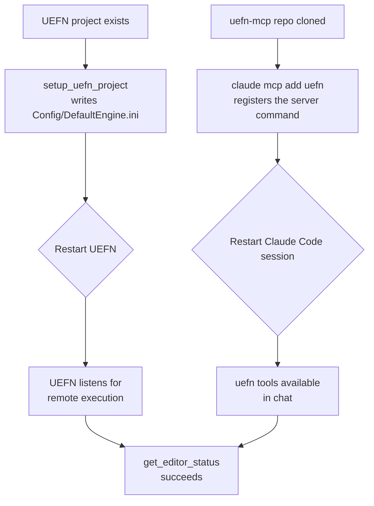
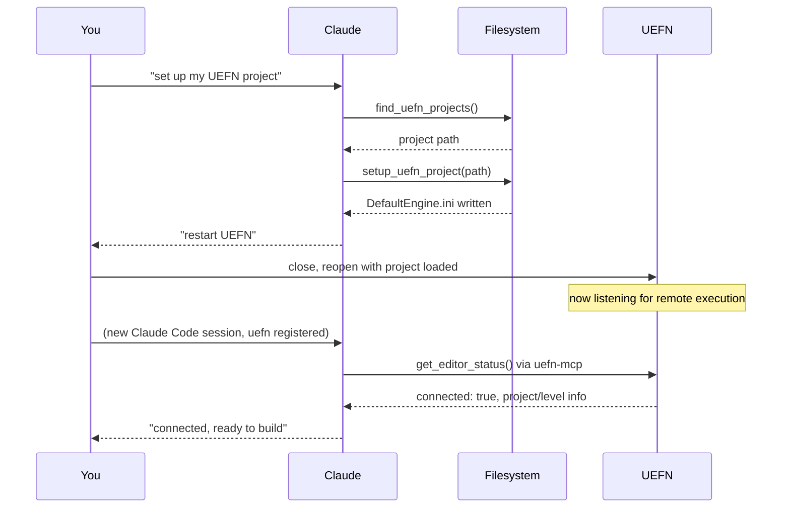

# Setup, and what it actually changes

Two independent things have to be true before any tool call in `server.py`
can reach a running editor. Neither is automatic, and both require a
restart of *something* to take effect — which is why setup feels like more
steps than it should.



## Side 1 — UEFN's remote execution setting

UEFN ships with the Python plugin's remote execution **off**. It's an
editor-startup setting, not something a running process can be told to flip
on live, so it lives in the project's own config file:

`<project folder>/Config/DefaultEngine.ini`

```ini
[/Script/PythonScriptPlugin.PythonScriptPluginSettings]
bRemoteExecution=True
RemoteExecutionMulticastGroupEndpoint=239.0.0.1:6766
RemoteExecutionMulticastBindAddress=127.0.0.1
RemoteExecutionMulticastTtl=0
```

`setup_uefn_project` (in `server.py`) edits this file directly — it finds
the `[/Script/PythonScriptPlugin.PythonScriptPluginSettings]` section (or
creates it) and sets these four keys, leaving anything else in the file
untouched. `find_uefn_projects` exists purely to locate the project folder
on disk first, by walking for a `*.uefnproject` file, since UEFN doesn't
expose that path anywhere `uefn-mcp` could otherwise query.

Because this file is only read at editor startup: **if UEFN was already
open when the file changed, it has to be closed and reopened.** No amount
of retrying the connection from `uefn-mcp`'s side will help until that
happens — `bridge.py`'s discovery step simply won't hear a `pong` from an
editor that never turned remote execution on.

## Side 2 — registering `uefn-mcp` with Claude Code

`claude mcp add uefn -- uv --directory "<repo path>" run uefn-mcp` tells
Claude Code *how to start* the `uefn-mcp` process — the exact command,
`uv --directory <repo path> run uefn-mcp`. Because `--directory` is baked
into that command, the server always runs against this repo checkout
regardless of the working directory the command happens to be typed in.

What *does* matter is **scope** — where that registration itself gets
stored, which controls when Claude Code even considers starting the server:

| Scope | Stored in | Available when... |
|---|---|---|
| `local` (default) | `~/.claude.json`, under the *current project's* entry | you start Claude Code from that one specific folder |
| `user` (`-s user`) | `~/.claude.json`, top-level, not tied to a project | you start Claude Code from anywhere |
| `project` (`-s project`) | `.mcp.json` checked into the repo | anyone with the repo, from that folder |

MCP servers are only started when a Claude Code **session starts** — adding
or changing a registration never affects a session already in progress.
That's the second restart: not UEFN this time, but Claude Code itself.

## Putting both sides together


